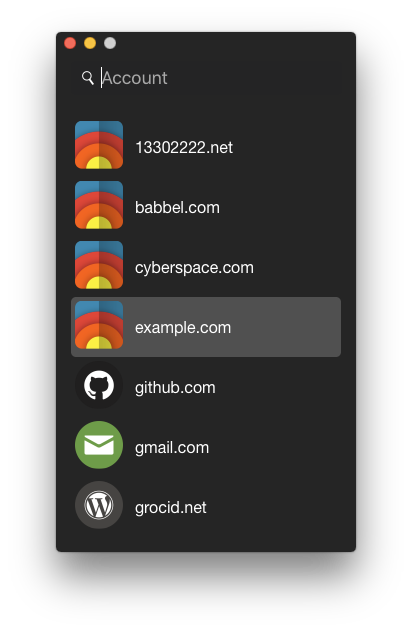
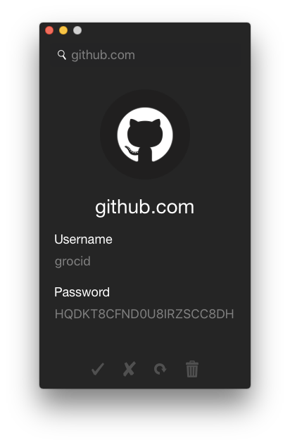

# Pass Desktop for macOS

Pass Desktop is a GUI for [pass](https://github.com/grocid/pass), but completely independent of it. It communicates with [Hashicorp Vault](https://www.vaultproject.io) (from now on called just Vault), where all accounts with associated usernames and passwords are stored. Any instance of Vault can be used, no additional setup. So if you are already running Vault, just generate a token and you are ready to go.

Pass is password protected on the local computer, by storing an `encrypted token` on disk, along with a `nonce` and `salt`. The `token` is encrypted with ChaCha20-Poly1305. The encryption key is derived as 
```go
key := Argon2(password, salt, *params)
```
and 
```go
token := ChaCha20-Poly1305-Decrypt(encrypted token, key, nonce).
```

The decrypted `token` is kept in memory only. Apart from that, it is actually agnostic to the underlying data storage (although, in the case of Vault the database in encrypted with a AES-GCM barrier, and protected with some additional security mechanisms such as token access and secret sharing). Therefore, all entries are encrypted with ChaCha20-Poly1305-Encrypt, under the same key as the token (but of course, different nonces). Inside Vault, the entries have the following format. 

```
{
    "<metadata>" : "<metadata>",
    "data": {
        "encrypted": "
        ----------------ENCRYPTED----------------   <-- not acutal data
            {
                "username": "grocid",
                "password": "banana",
                "file": [bytes],
                "padding": "ASDFvcasdfgSDFDSFASDfsdfmlksdf9032"
            }
        -----------------------------------------  <-- not acutal data
        "
    }
}

```
The `padding` is a random string which pads the encrypted data to a minimum length. This to make sure no useable information is leaked (e.g. if your password happens to be very short, then it may be reflected in the length of the ciphertext). Large files are identifiable as files, of course, by just looking at the ciphertext. The account name is also encrypted, in case you do not want to leak which sites you are registred on. In terms of Vault, the get request for a specific secret, let us say Github, would be something like 

```sh
GET /secret/6bb5d1af6cf022c8df559a1b4b0217c92d4e33ffd20abd72865dcccf
```

Pass perfoms, at every query, real-time decryption of the content. No data is explicitly stored on disk.


The program is fairly short and easily auditable, if anyone feels encouraged to do it.

## Not implemented...

 - Mutual authentication as an option for communicating with Vault

## Seurity considerations

 - To use mutual authentication. This requires each accessor/user to have a valid private key. Private key can be encrypted with master password.
 - Using [fw](https://github.com/grocid/fw) to only allow white-listed users. Requires the user to authenticate with Google Authenticator to white list its IP address. Makes it harder for attackers, but does not yield any real security.
 - (*Slightly deprecated*) To use root token or regular tokens: when sharing a server with multiple users and associated (disjoint) storage areas, different tokens are needed and, hence, root token cannot be used. In even in single-user mode, use of root token is not recommended.
 - (*Slightly deprecated*) Trusting a third-party server. The holder of the root token (or a group/individual holding of the unseal keys) will be able to read all data stored in Vault. However, Vault is quite light weight and can, for a limited amount of users, be run on a mere Raspberry Pi gen A. I would suggest that each user runs Vault on their own Raspberry Pi at home. Secrets can be shared over several VPS instances and providers using secret sharing. While at a higher cost, it would give higher security and accessibility (as a e.g. (3, 2) scheme would require only two out of three servers to be online).
 - If the password has a lot lower entropy than 256 bits, then the iteration count / Argon2 parameters need to be increased considerably if you are planning on leaking your config file.

### How to sync between devices

If you created an App with macpack, then you can simply copy the App, because `ca.crt` and `config.json` will be included. Otherwise these two files need to be copied as well. Even though the token in `config.json` is encrypted, I suggest not storing the config on insecure media like Dropbox or unencrypted mail.

### Possible leaks

When an Apple computer goes into hibernation (not regular sleep), in-memory contents are transferred to disk. The Filevault key itself can be recovered when device is in sleep (default for desktops), or deep/hybrid sleep, or whatever they call it (default for laptops), so presumably the token is also somewhere. The difference (in description) between hybrid and full hibernation is only that memory power is disconnected, so it might mean that in the hibernation file you also have all keys. And there is also a, notably non-standard, option to wipe the Filevault key each time the system goes to standby. By default Apple do not wipe the key -- this is usability consideration -- user gets faster response from system and no annoying passwords are needed.

There is the ```pmset somethingVaultKeysomethingsomething``` setting. If you are concerned about this, I suggest you do some own research.

What about Spectre and Meltdown? Pass Desktop is agnostic to these attacks. If the operating system is vulnerable, your memory will leak no matter what.

## Performance

Pass Desktop keeps no information stored on disk. Search operations are done by performing a LIST (Hashicorp-specific operation), which fetches a JSON with all keys (account names) from the server, after which decryption and filtering operations are performed locally. This is done every search query, so with a slow server, the user experience may not be as intended. The same applies for very long lists of accounts. Moreever, Pass Desktop keeps an iconset, where each filename is associated with the account name (favicons are too small). Since there is a mapping betwen account names and the iconset, the recommended convention is to name accounts after the domain. The iconset can be extended by the user with minor effort. The memory usage is about 50 MBs of RAM.

## Building

It is as simple as
```sh
go build
```
which creates a standalone executable. To build a real .App, I suggest using [macpack](https://github.com/murlokswarm/macpack).

The application will try to load your CA certificate, located as an entry inside `config.json`.
CA will be used to authenticate the server you are running Vault on (we do not really need anything else than a self-signed certificate). When you setup your server, you generated a CA. This is the file you need.
The configuration `config.json` is a file of the format

```json
{
	"encrypted": {
		"token": "...",
		"salt": "..."
	},
	"host": "myserver.com",
	"port": "8001",
    "ca": "-----BEGIN CERTIFICATE-----\n...\n-----END CERTIFICATE-----"
}
```
(*Slightly deprecated*) To get the encrypted part, you need to invoke the function `LockToken (plaintext string, password string)` in `crypto.go`:
```go
LockToken("your token", "your master password")
```
and put these into the JSON.

## Setting up the backend

To get Pass working, you need to install and configure Vault on the remote server. First, start the storage backend for Vault. This can be SQL, but I would recommend [Consul](https://www.consul.io). Start Consul as follows:
```sh
consul agent -server -config-dir=/etc/consul.d/bootstrap/ > /dev/null 2>&1 &
```
Let the contents of `/etc/consul.d/bootstrap/config.json` be
```json
{
    "bootstrap": true,
    "server": true,
    "datacenter": "pass",
    "data_dir": "/var/consul",
    "encrypt": "<secret>",
    "ca_file": "/etc/consul.d/ssl/ca.crt",
    "cert_file": "/etc/consul.d/ssl/consul.crt",
    "key_file": "/etc/consul.d/ssl/consul.key",
    "verify_incoming": true,
    "verify_outgoing": true,
    "log_level": "INFO",
    "enable_syslog": false
}
```
Then, Vault can be started in the following way.
```sh
vault server -config=/etc/vault.d/config.json > /dev/null 2>&1 &
```
where `/etc/vault.d/config.json` contains
```json
{
    "storage": {
        "consul": {
            "address": "127.0.0.1:8500",
            "advertise_addr": "https://127.0.0.1:8200",
            "path": "vault"
        }
    },
    "listener": {
        "tcp": {
            "address": "127.0.0.1:8200",
            "tls_cert_file": "/etc/vault.d/ssl/vault.crt",
            "tls_key_file": "/etc/vault.d/ssl/vault.key",
            "tls_disable": 0
        }
    }
}
```
Vault binds to `127.0.0.1`, so we need fw to access it (if you do not want to use fw, then bind the listener to `0.0.0.0:8001`). We can start it as
```sh
./fw 0.0.0.0:8001 127.0.0.1:8200 2>&1 &
```

The more proper way to start Consul, Vault and fw would be to create an init.d or systemd service, but this is fine for testing purposes.

## Icon pack

[Somacro](http://veodesign.com/2011/en/11/08/somacro-27-free-big-and-simple-social-media-icons/)

## Screenshots






Note: the passwords shown are of course fully working. Do not try to use them!