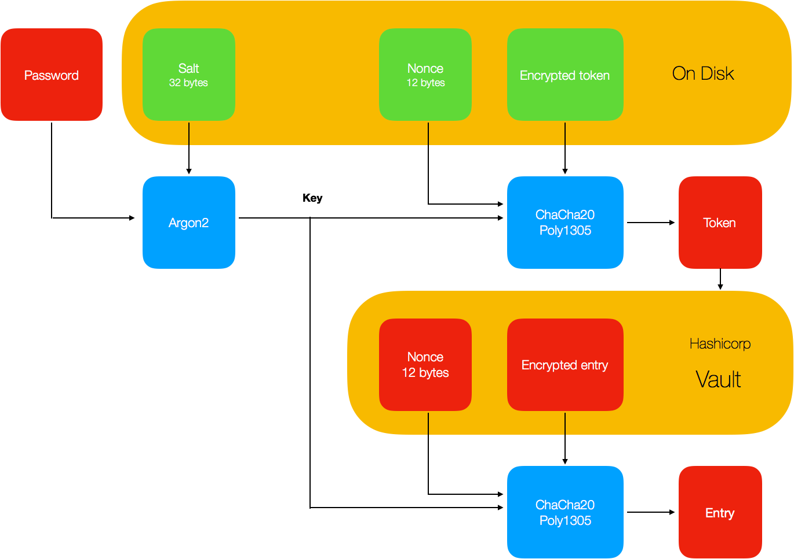

# Pass Desktop for macOS

Pass Desktop is a GUI for [pass](https://github.com/grocid/pass), but completely independent of it. It communicates with [Hashicorp Vault](https://www.vaultproject.io) (from now on called just Vault), where all accounts with associated usernames and passwords are stored. Any instance of Vault can be used, no additional setup. So if you are already running Vault, just generate a token and you are ready to go.

### Encrypted data

Pass is password protected on the local computer, by storing an `encrypted token` on disk, along with a `nonce` and `salt`. The `token` is encrypted with ChaCha20-Poly1305 (for which there are basically no attacks at this date). The encryption key is derived as 

```go
key := Argon2(password, salt, *params)
```
and 

```go
token := ChaCha20-Poly1305-Decrypt(encrypted token, key, nonce).
```

The decrypted `token` is kept in memory only. Apart from that, it is actually agnostic to the underlying data storage. Therefore, all entries are encrypted with ChaCha20-Poly1305-Encrypt, under the same key as the token (but of course, different nonces). Although, in the case of Vault the database in encrypted with a AES-GCM barrier and protected with some additional security mechanisms such as token access and secret sharing. 

When you have configured Pass and you start it. You will be presented with the following screen, which requires you to input your password.

Inside Vault, the entries have the following format. 

```
{
    "<metadata>" : "<metadata>",
    "data": {
        "encrypted": "
        ----------------ENCRYPTED----------------   <-- not actual data
            {
                "username": "grocid",
                "password": "banana",
                "file": [bytes],
                "padding": "..."
            }
        -----------------------------------------  <-- not actual data
        "
    }
}

```

The `padding` is a random string which pads the encrypted data to a minimum length. This to make sure no useable information is leaked (e.g. if your password happens to be very short, then it may be reflected in the length of the ciphertext). Large files are identifiable as files, of course, by just looking at the ciphertext. The account name is also encrypted, in case you do not want to leak which sites you are registered on (provided the improbable scenario that your token gets stolen but not your salt and password, or that your server provider is malicious and is able to intercept the unseal keys to your Vault instance). 


After unlocking the token, the search view will be available to you:


Below is a screenshot from the account view. There is a possibility to generate passwords at random by pressing the die. If you accidentially press it, just press the cancel (X) button.


In terms of Vault, the get request for a specific secret, let us say Github, would be something like 

```sh
GET /secret/6bb5d1af6cf022c8df559a1b4b0217c92d4e33ffd20abd72865dcccf
```

Pass perfoms, at every query, real-time decryption of the content. No data is explicitly stored on disk.



### OTP

Vault has an option for OTP, in which case the shared secret is stored inside Vault. The drawback here is that it will rely only on the AES-GCM wall, which of course might be enough. On the other hand, if the security of the server is comprimised any such data will leak.

As a consequence, Pass stores the shared secret in Vault as a normal entry (which is encrypted with the local key, not known to the server). The shared secret is fetched and then Pass generates the OTP locally using the encryption keys. Note that (this sort of) takes the purpose out of multi-factor authentication and should therefore be used conservatively. Please be aware of this.


### Files

It is possible to store files in the same way as user credentials are stored. Files are then downloaded and decrypted on the local computer. Due to limitations in Vault, the maximum file size is 512 kB.


### Signing keys

Pass has an option to generate Ed25519 key pairs for signing and verification. To sign a file, simply press the signing button (marked in the screenshot below) and select a file. A new file containing the signature will be generated, with the file ending `.signature`.


The Base64-encoded text shown above is your public key. It can be distributed and is used to verify the signature.

### Other capabilites

It is pretty easy to implement another type of entry. If you want feature X, look at any implemented type.

So, why have I decided to use Vault as the storage? Vault is widely used software for storing secrets and exists in many production environments. It is reasonably fast (I would say, about as fast a normal database). Pass Desktop should be a plug-and-play experience. Nonetheless, if one would like to use a different kind of storage, rewriting the operations to another database is smooth sailin' ;-)

## Seurity considerations

 - To use mutual authentication. This requires each accessor/user to have a valid private key. Private key can be encrypted with master password.
 - Using [fw](https://github.com/grocid/fw) to only allow white-listed users. Requires the user to authenticate with Google Authenticator to white list its IP address. Makes it harder for attackers, but does not yield any real security.
 - The ideal solution would be to use an OTP such as Google Authenticator to authenticate directly to Vault (and not fw), which would give a session last for a certain amount of time. So, even if your laptop gets stolen and extremely short password is determined by bruteforce, you would still need an OTP to gain access (unless the session still is valid).
 - (*Slightly deprecated*) To use root token or regular tokens: when sharing a server with multiple users and associated (disjoint) storage areas, different tokens are needed and, hence, root token cannot be used. In even in single-user mode, use of root token is not recommended.
 - (*Slightly deprecated*) Trusting a third-party server. The holder of the root token (or a group/individual holding of the unseal keys) will be able to read all data stored in Vault. However, Vault is quite light weight and can, for a limited amount of users, be run on a mere Raspberry Pi gen A. I would suggest that each user runs Vault on their own Raspberry Pi at home. Secrets can be shared over several VPS instances and providers using secret sharing. While at a higher cost, it would give higher security and accessibility (as a e.g. (3, 2) scheme would require only two out of three servers to be online).
 - If the password has a lot lower entropy than 256 bits, then the iteration count / Argon2 parameters need to be increased considerably if you are planning on leaking your config file.
 - No communication with other clients, only authenticated servers.

 ### Why use two encryption layers?

It may seem unncessary to encrypt data twice. If you are running a secured instance of Vault -- then probably -- yes. What comes into play here is the distribution of cryptographic keys. If you are running a pure Vault setup, then your server knows all the secrets. You will not be able to read data from disk, since Vault does in-memory decryption, but if you get hold of a token or a memory dump or can leak memory using recent attacks, then your data is in trouble.

### Possible leaks

When an Apple computer goes into hibernation (not regular sleep), in-memory contents are transferred to disk. The Filevault key itself can be recovered when device is in sleep (default for desktops), or deep/hybrid sleep, or whatever they call it (default for laptops), so presumably the token is also somewhere. The difference (in description) between hybrid and full hibernation is only that memory power is disconnected, so it might mean that in the hibernation file you also have all keys. And there is also a, notably non-standard, option to wipe the Filevault key each time the system goes to standby. By default Apple do not wipe the key -- this is usability consideration -- user gets faster response from system and no annoying passwords are needed.

There is the ```pmset somethingVaultKeysomethingsomething``` setting. If you are concerned about this, I suggest you do some own research.

What about Spectre and Meltdown? Pass Desktop is agnostic to these attacks. If the operating system is vulnerable, your memory will leak no matter what.

### Can I connect with other users?

Although it would be nice to create shared areas in Vault (e.g. for sharing a Netflix account), there is no such option as of now. Direct communcation between clients is advised against, since that is a quite servere attack vector. The client will only talk to an authenticated server. If the server is overtaken by a malicious party then it could -- potentially -- inject data. This may or may not pose a threat, in case there is some bug in the REST implementation or in Golangs libraries.

### How to sync between devices

If you created an App with macpack, then you can simply copy the App, because the configuration file  will be included. It is therefore totally inappropriate to distribute the App.

If you build pass in another way, the file `config.json` needs to be copied to the target computer. Even though the token in the configuration file is encrypted, I suggest not storing the it on insecure media like Dropbox or unencrypted mail.


## Performance

Pass Desktop keeps no information stored on disk. Search operations are done by performing a `LIST` (Hashicorp-specific operation), which fetches a JSON with all keys (account names) from the server, after which decryption and filtering operations are performed locally. 

### Minimizing query complexity

Every time a `PUT` or  `DELETE` is invoked, it will simultaneously update a tag (random value) on the path `/secret/updated`, but also a local variable `LocalUpdate`. When performing a search, it will check whether if `LocalUpdate == true` (in case the modifying operation came from the local client). If not, it will check if `/secret/updated` matches a locally stored value. If `LocalUpdate` was set or the tags dont match, Pass will fetch the contents from the server. This, to avoid fetching already known data. This makes the less common `PUT` and `DELETE` twice as expensive in terms of requests made, but as a trade-off, searching large lists will be much less expensive.

### Graphics

Moreever, Pass Desktop keeps an iconset, where each filename is associated with the account name (favicons are too small). Since there is a mapping betwen account names and the iconset, the recommended convention is to name accounts after the domain. The iconset can be extended by the user with minor effort. The memory usage is about 50 MBs of RAM.

## Building

It is as simple as

```sh
go build
```

which creates a standalone executable. To build a real .App, I suggest using [macpack](https://github.com/murlokswarm/macpack). This is equally simple:

```sh
macpack build
```

The application will try to load your certificate authority (CA), located as an entry inside `config.json`.
The CA will be used to authenticate the server you are running Vault on (we do not really need anything else than a self-signed certificate). When you setup your server, you generated a CA. This is the file you need.
The configuration `config.json` is a file of the format

```json
{
    "encrypted": {
        "token": "...",
        "salt": "..."
    },
    "host": "myserver.com",
    "port": "8001",
    "ca": "-----BEGIN CERTIFICATE-----\n...\n-----END CERTIFICATE-----"
}
```

## Setting up the backend

To get Pass working, you need to install and configure Vault on the remote server. First, start the storage backend for Vault. This can be SQL, but I would recommend [Consul](https://www.consul.io). Start Consul as follows:

```sh
consul agent -server -config-dir=/etc/consul.d/bootstrap/ > /dev/null 2>&1 &
```

Let the contents of `/etc/consul.d/bootstrap/config.json` be

```json
{
    "bootstrap": true,
    "server": true,
    "datacenter": "pass",
    "data_dir": "/var/consul",
    "encrypt": "<secret>",
    "ca_file": "/etc/consul.d/ssl/ca.crt",
    "cert_file": "/etc/consul.d/ssl/consul.crt",
    "key_file": "/etc/consul.d/ssl/consul.key",
    "verify_incoming": true,
    "verify_outgoing": true,
    "log_level": "INFO",
    "enable_syslog": false
}
```

Then, Vault can be started in the following way.

```sh
vault server -config=/etc/vault.d/config.json > /dev/null 2>&1 &
```

where `/etc/vault.d/config.json` contains

```json
{
    "storage": {
        "consul": {
            "address": "127.0.0.1:8500",
            "advertise_addr": "https://127.0.0.1:8200",
            "path": "vault"
        }
    },
    "listener": {
        "tcp": {
            "address": "127.0.0.1:8200",
            "tls_cert_file": "/etc/vault.d/ssl/vault.crt",
            "tls_key_file": "/etc/vault.d/ssl/vault.key",
            "tls_disable": 0
        }
    }
}
```

Vault binds to `127.0.0.1`, so we need fw to access it (if you do not want to use fw, then bind the listener to `0.0.0.0:8001`). We can start it as

```sh
./fw 0.0.0.0:8001 127.0.0.1:8200 2>&1 &
```

The more proper way to start Consul, Vault and fw would be to create an init.d or systemd service, but this is fine for testing purposes.

## Icon pack

[Somacro](http://veodesign.com/2011/en/11/08/somacro-27-free-big-and-simple-social-media-icons/)